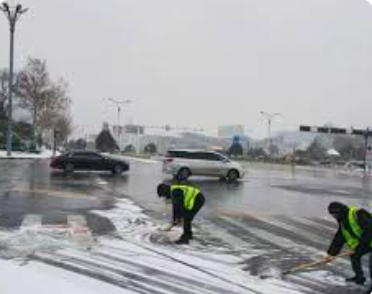
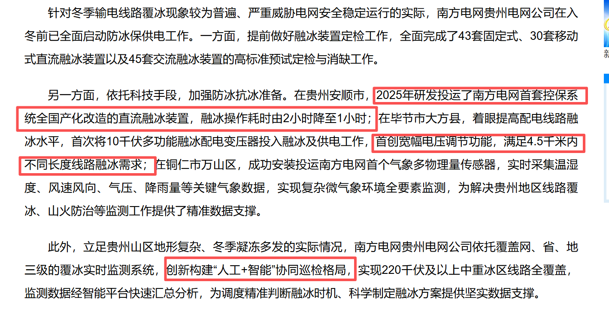
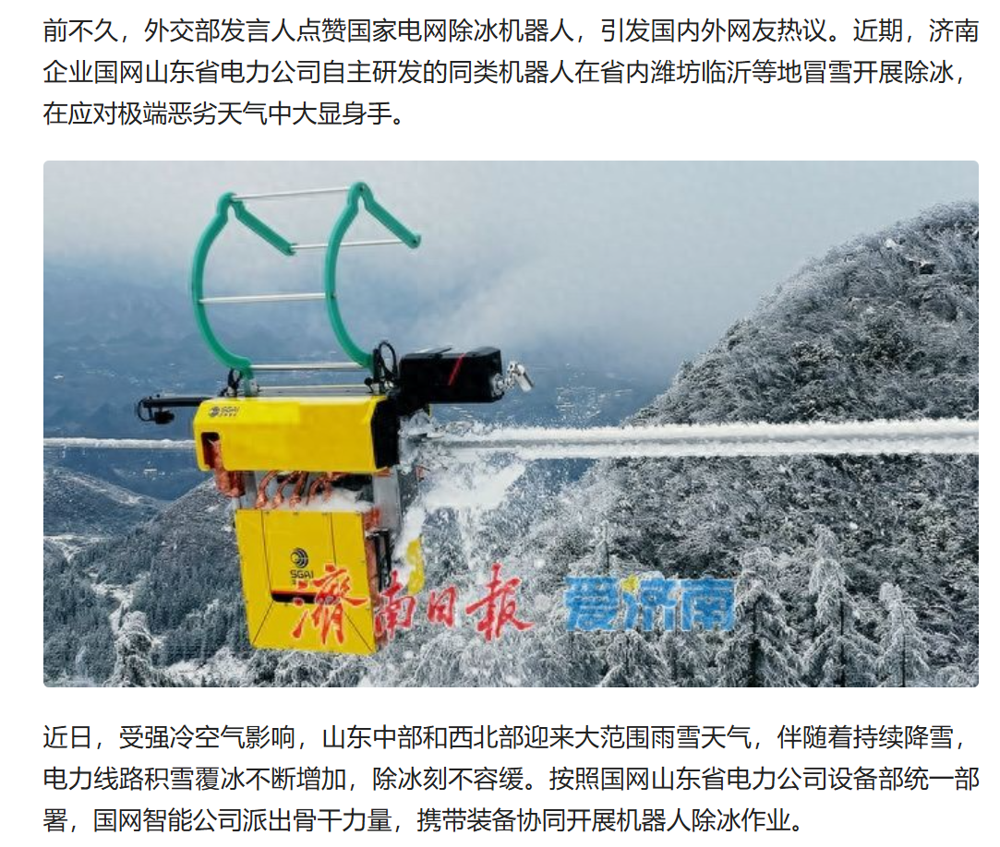
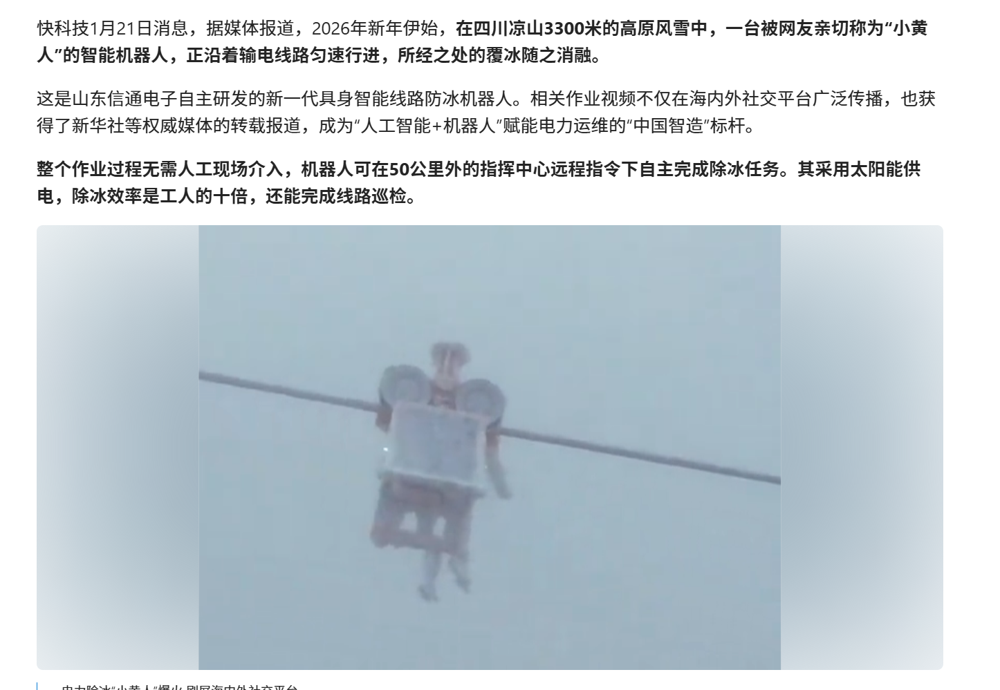
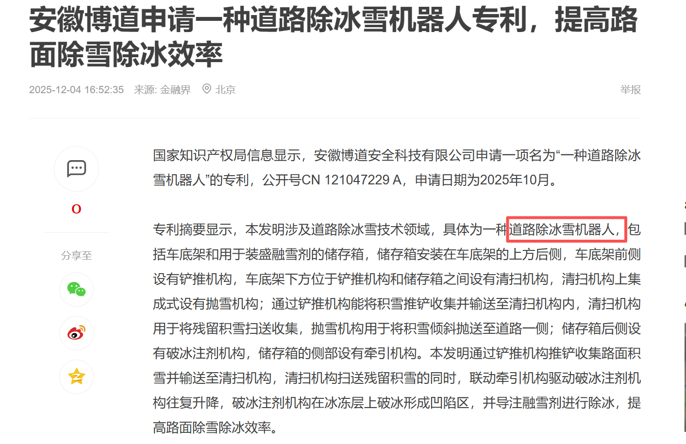
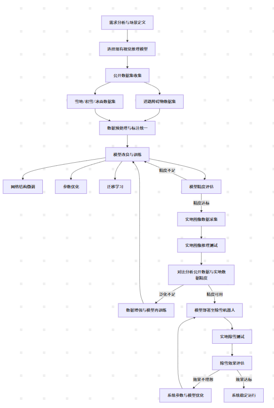

# 除冰系统可行性与视觉算法侧分析

## 贵州冬季道路结冰面临痛点

贵州冬季 12–2 月频繁道路结冰，山区多、桥梁多、背阴路段多

- __车辆打滑、失控:__ 结冰路面摩擦系数极低，制动距离大幅增加，极易发生追尾、侧滑、翻车事故。
- __山区事故风险更高：__ 贵州多为盘山公路、急弯、陡坡，一旦结冰，危险性成倍上升。
- __其它危害:__ 出行物流、上班上学等均受到不同程度的影响

## 现存解决方案

贵州不同地区出现了"人工+智能"冰面巡检格局，并且除冰装置在不断进步

电线除冰机器人在济南、凉山多个地方均已出现

## 方向

针对冰雪道路，询问客户痛点，有目标方向地进行研发。

如何对雪路进行识别？
如何进行路面自动识别？

## 可行性分析

目前已经出现智能除雪机器人，本除雪项目仍具备一些商用价值，但该必须针对某些特定路段进行研究（可对接有需求客户进行询问），先满足这部分人员需求，待客户使用产生好评推广，再进行进一步优化扩展，能较大程度节省成本和人力资源。

## 建议方案

### 视觉算法部分: 

__冰面分类任务__:

初步使用ResNet-18 / 34、MobileNetV2、EfficientNet-B0对冰面进行分类（坚冰/碎雪等），并进行路面自动识别。设定一个最低要求精度，训练模型必须达到该精度才能进行模型机的使用

__定位结冰区域__:

使用YOLO系列算法进行检测，如需高精度除冰，精确到像素，可采用DeepLabV3++等。 

### 数据集

自采道路图像、雪天/冰面公开数据集、人工合成图片数据等。

针对贵州山区道路采集图像数据集如何进行，

### 初拟技术路线

1、改良现有推理模型，使用网上现有数据集（有关道路障碍物，雪等）进行训练，提升模型精度。
2、获得实地图像数据，测试在模型该数据集精度，并逐步提升至可用精度
3、模型接入机器，实地测试除雪效果，并进行优化。

### 成本考量

硬件成本：算力、云检测系统、实地数据集采集等
其它成本：系统运营和维护等

https://arxiv.org/abs/2511.05108

https://openaccess.thecvf.com/content/ICCV2023W/BRAVO/papers/Cordes_Camera-Based_Road_Snow_Coverage_Estimation_ICCVW_2023_paper.pdf

https://onlinelibrary.wiley.com/doi/10.1111/mice.13233

https://www.mdpi.com/2079-9292/11/5/786

https://link.springer.com/article/10.1007/s43503-023-00010-6

识别和控制逻辑 