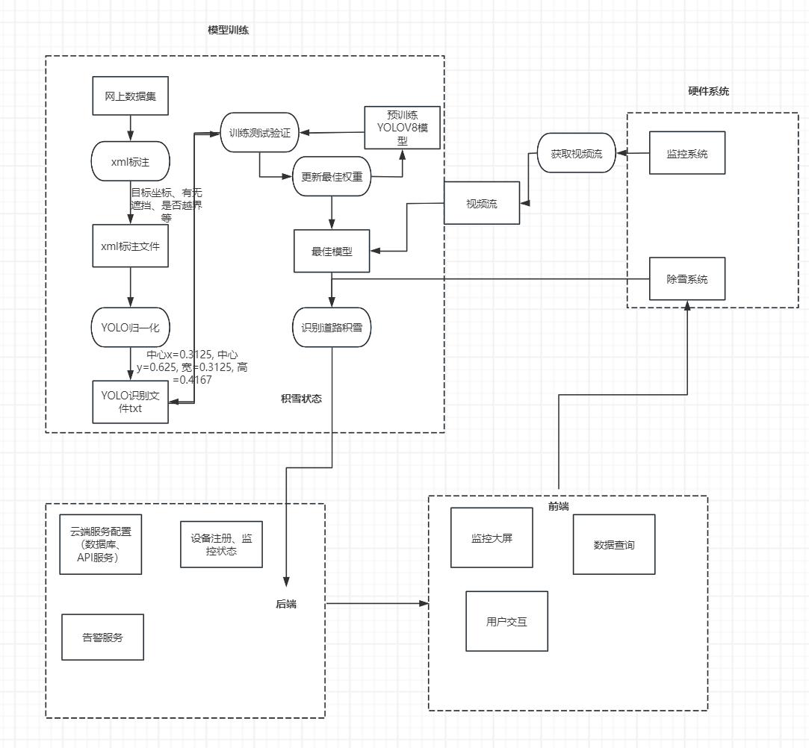
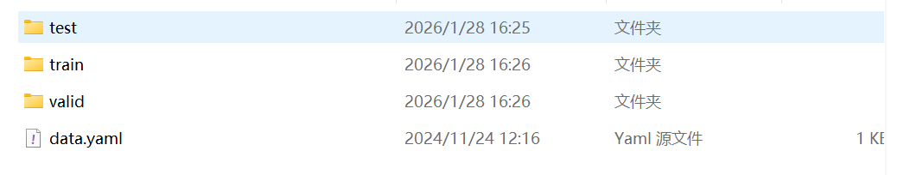
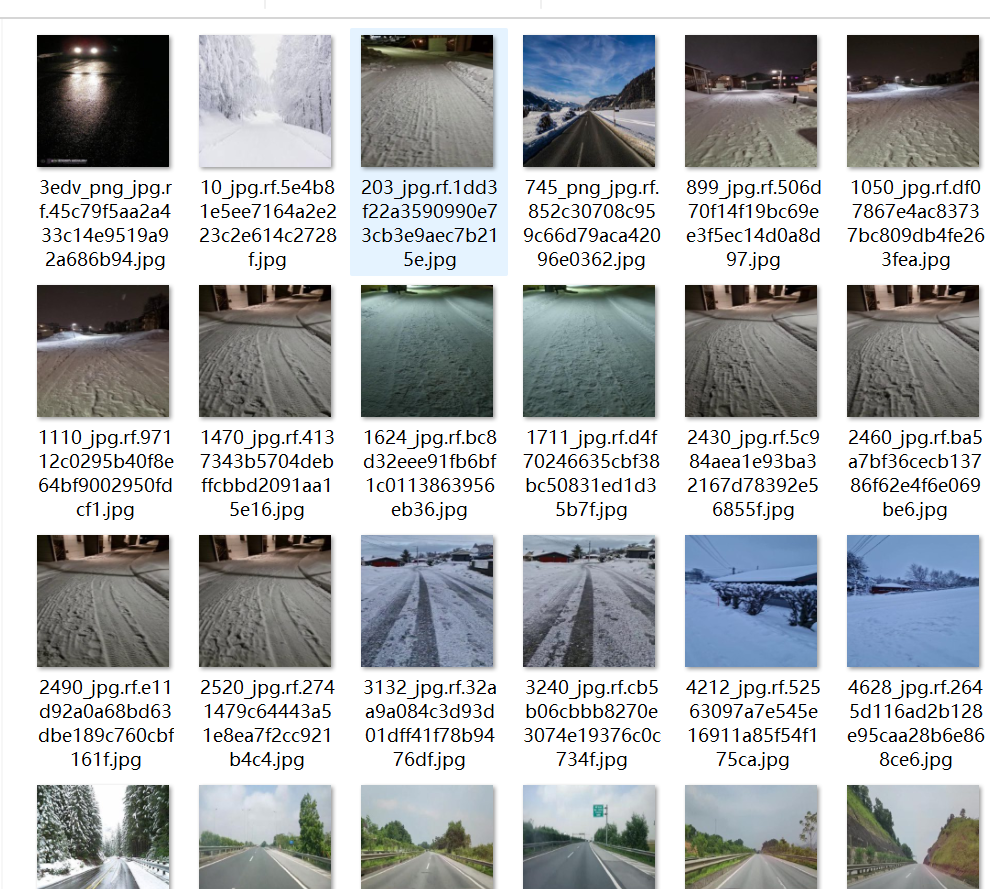

# 算法

## 数据集和雪景识别

采用YOLOV8算法作为识别模型，训练网上现有冰雪道路数据集

test、train、valid分别包含了Annotations、images、labels三个文件夹

Annotations文件夹包含了训练集的标注xml文件，images文件夹包含了训练集的图片，labels文件夹包含了训练集的标签文件

## 系统控制

前端：告警界面、登录、数据界面（除雪剂量、温度、雪度等）（模型识别数据）（机器电量状态等）等
后端：数据存储、网络连接协议、API接口、部署服务器

## 参考

[ultralytics](https://github.com/ultralytics/ultralytics)

[积雪结冰](https://blog.csdn.net/kyriehan/article/details/144022625)
